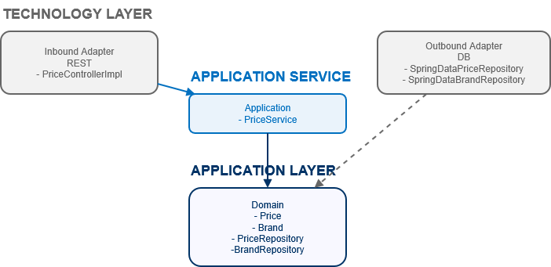
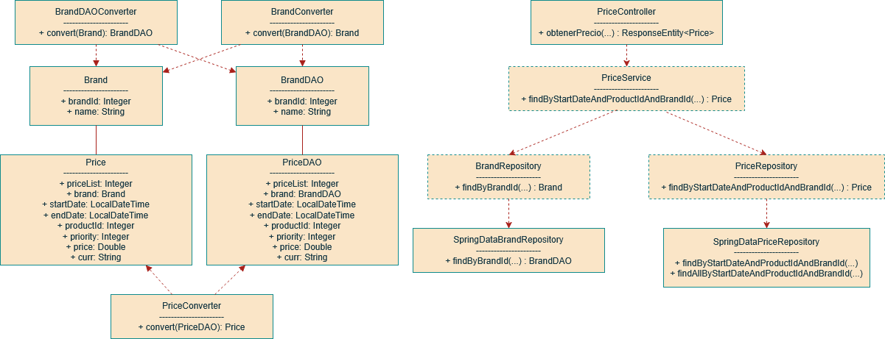

# spring-boot-h2-prices

## Overview
El siguiente repositorio contiene la prueba de Francisco José Páez Gordillo para BCNC Group.

## System requirements
* Java 21
* Spring Boot 3.1.0
* Gradle
* H2 Database
* Lombok

## Endpoint principal

`GET /api/obtenerPrecio/{brandId}/{productId}?startDate=dd-MM-yyyy HH:mm:ss`

**Parámetros:**
- `brandId` (path): Identificador de la cadena (ej: 1)
- `productId` (path): Identificador del producto (ej: 35455)
- `startDate` (query): Fecha y hora de aplicación (ej: 14-06-2020 10:00:00)

**Respuesta:**
- id de producto
- id de cadena
- tarifa a aplicar (price_list)
- fechas de aplicación (start_date, end_date)
- precio final (price)

## Inicialización de la base de datos

La base de datos H2 se inicializa automáticamente con los datos de ejemplo al arrancar la aplicación (ver `src/main/resources/data.sql`).

## Ejecución

1. Clona este repositorio
2. Ejecuta `gradle bootRun` o ejecuta la clase `PricesH2Application`
3. Accede a la API en `http://localhost:8080/canalcliente/api/obtenerPrecio/{brandId}/{productId}?startDate=14-06-2020 10:00:00`

## Pruebas

Se incluyen tests de integración en `PriceControllerTest` que validan los siguientes casos:
- 14-06-2020 10:00:00, producto 35455, brand 1
- 14-06-2020 16:00:00, producto 35455, brand 1
- 14-06-2020 21:00:00, producto 35455, brand 1
- 15-06-2020 10:00:00, producto 35455, brand 1
- 16-06-2020 21:00:00, producto 35455, brand 1

Ejecuta `gradle test` para validar los tests.

## Guidelines
Run the example:

1. Clone this repository
2. Go to release directory and start run.bat
3. Una vez la app Java arranque, abre el navegador y accede a [Swagger UI](http://localhost:8080/canalcliente/swagger-ui/index.html)

## Autor
- Francisco José Páez Gordillo (frapaego@gmail.com)
